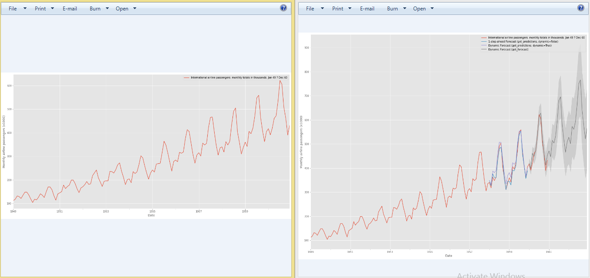
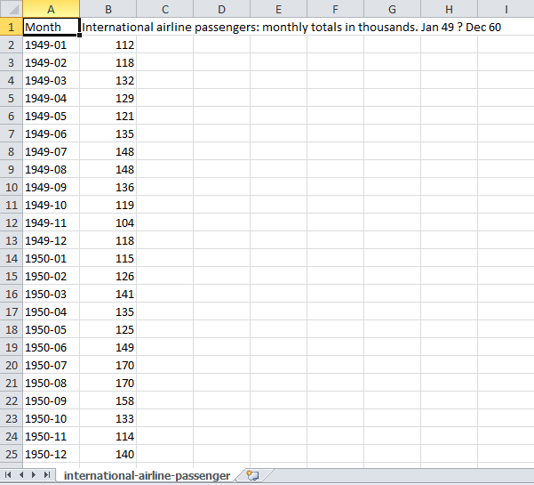
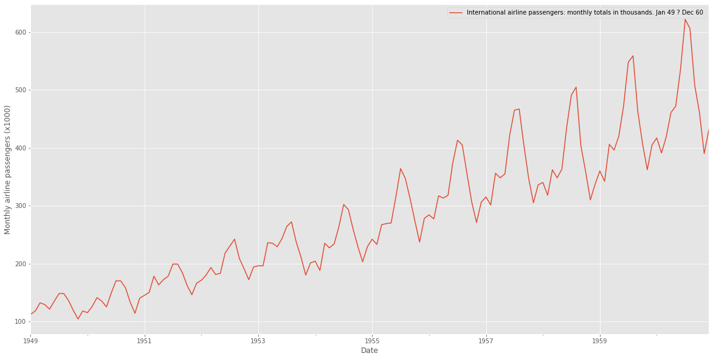
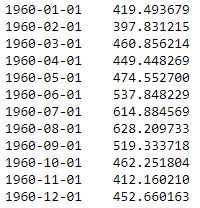
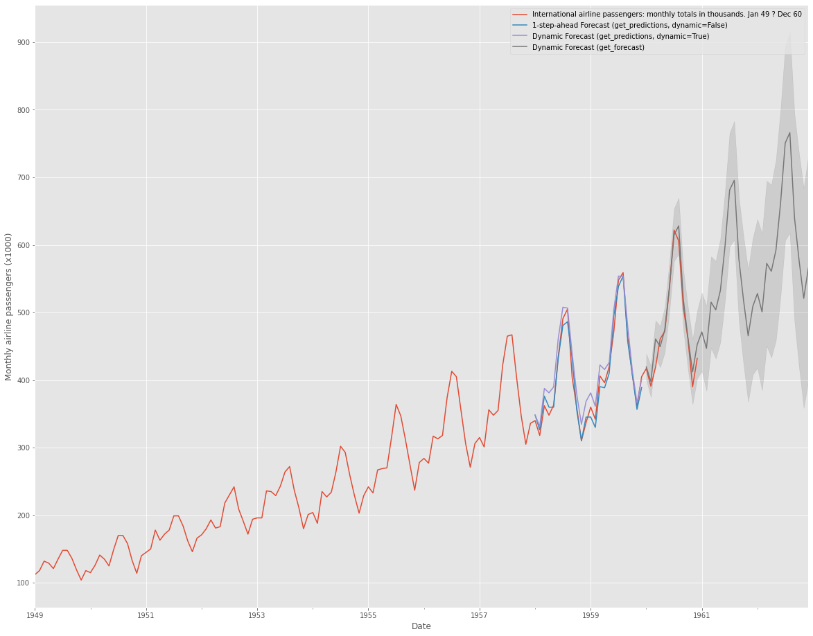

# Forecasting airline passengers 

This is an implementation of Time series analysis with arima on Python 3, Keras, and TensorFlow. The model can forecast how many passengers in th future.

The repository includes:
* Airline passengers Data
* Training code 
* Testing code
* Jupyter notebooks to visualize the detection pipeline at every step
* Evaluation code

# Getting Started
* open the code time-series-analysis-ARIMA.ipynb (include all)

# step to run the codes

## 1. Prepare dataset 
in this project i use airline passengers, u can see the data below

## 2. Plot the data  
this step will plot the data so we can see in linear graph

## 3. predict in 12 month in future
u will see the predict number 

## 4. plot the predict in 12 month in future
this step just plot the the predict in linear graph

## 5. execute all programs
just run all codes
